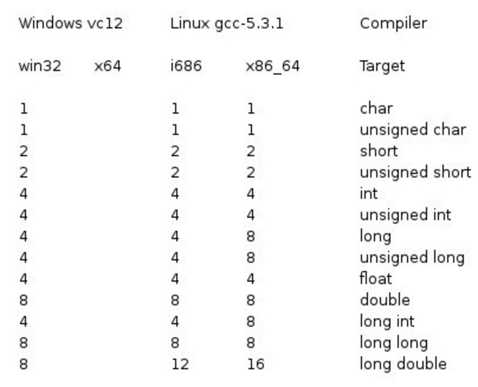
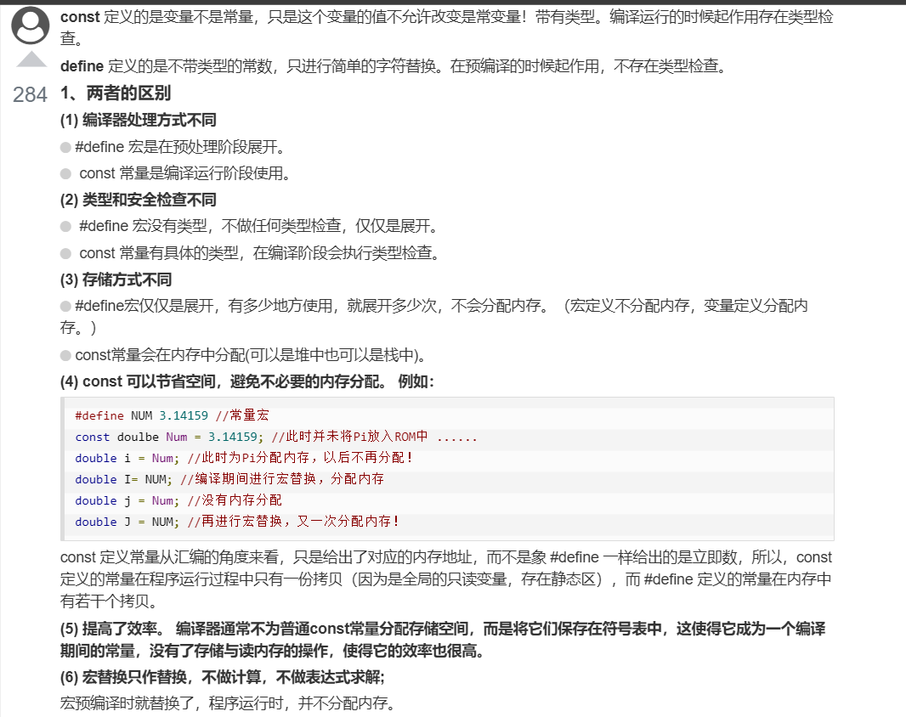

<!--C基础复习参考菜鸟教程-->
# 1 数据类型
## 1.1 基本数据类型
**它们是算术类型**
> - int 整型
> - char 字符型
> - float 浮点型
> - double 双精度浮点型

## 1.2 枚举类型
**也是算术类型**
> 只能赋予其一定的离散整数值的变量

## 1.3 void 类型
**表明没有值的数据类型**

## 1.4 派生类型
> - 数组类型
> - 指针类型
> - 结构体类型


<font color=red>各种类型的存储大小与系统位数有关，但目前通用的以64位系统为主。
以下列出了32位系统与64位系统的存储大小的差别（windows 相同）：</font>


## 1.5 强制类型转换

> - **隐式类型转换**：隐式类型转换是在表达式中自动发生的，无需进行任何明确的指令或函数调用。**它通常是将一种较小的类型自动转换为较大的类型，例如，将int类型转换为long类型或float类型转换为double类型。隐式类型转换也可能会导致数据精度丢失或数据截断。**
> - **显式类型转换**：**显式类型转换需要使用强制类型转换运算符（type casting operator），它可以将一个数据类型的值强制转换为另一种数据类型的值**。强制类型转换可以使程序员在必要时对数据类型进行更精确的控制，但也可能会导致数据丢失或截断。
```c
/*隐式类型转换实例*/
int i = 10;
float f = 3.14;
double d = i + f; // 隐式将int类型转换为double类型

/*显式类型转换实例*/
double d = 3.14159;
int i = (int)d; // 显式将double类型转换为int类型
```


# 2 C常量

## 2.1 整数常量

> 整数常量可以是十进制、八进制或十六进制的常量。**前缀指定基数：0x 或 0X 表示十六进制，0 表示八进制，不带前缀则默认表示十进制。**
> 整数常量也可以带一个后缀，<font color=red>后缀是 U 和 L 的组合，U 表示无符号整数（unsigned），L 表示长整数（long）。后缀可以是大写，也可以是小写，U 和 L 的顺序任意。但是不能重复。</font>

```c
212         /* 合法的 */
215u        /* 合法的 */
0xFeeL      /* 合法的 */
078         /* 非法的：8 不是八进制的数字 */
032UU       /* 非法的：不能重复后缀 */

/*下面是各种类型的整数常量的实例*/
85         /* 十进制 */
0213       /* 八进制 */
0x4b       /* 十六进制 */
30         /* 整数 */
30u        /* 无符号整数 */
30l        /* 长整数 */
30ul       /* 无符号长整数 */
```

## 2.2 浮点常量

> - 浮点常量由整数部分、小数点、小数部分和指数部分组成。您可以使用小数形式或者指数形式来表示浮点常量。
> - 当使用小数形式表示时，必须包含整数部分、小数部分，或同时包含两者。当使用指数形式表示时， 必须包含小数点、指数，或同时包含两者。带符号的指数是用 e 或 E 引入的。

```c
/*浮点常量的例子*/
3.14159       /* 合法的 */
314159E-5L    /* 合法的 */
510E          /* 非法的：不完整的指数 */
210f          /* 非法的：没有小数或指数 */
.e55          /* 非法的：缺少整数或分数 */
```

## 2.3 字符常量和字符串常量

> - 字符常量是记录在在单引号中的
> 字符常量可以是一个普通的字符（例如 'x'）、一个转义序列（例如 '\t'），或一个通用的字符（例如 '\u02C0'）.在 C 中，有一些特定的字符，当它们前面有反斜杠时，它们就具有特殊的含义，被用来表示如换行符（\n）或制表符（\t）等。
> - 字符串常量是记录在双引号中的

## 2.4 定义常量

> 1. **使用 #define 预处理器： #define 可以在程序中定义一个常量，它在编译时会被替换为其对应的值。**
> 2. **使用 const 关键字：const 关键字用于声明一个只读变量，即该变量的值不能在程序运行时修改。**

```c
/*把常量定义为大写字母形式，是一个很好的编程习惯*/

/*define 定义常量*/

#define 常量名 常量值
#define PI 3.14159

/*const 定义常量*/
const 数据类型 常量名 = 常量值;
/*下面的代码定义了一个名为MAX_VALUE的常量：*/
const int MAX_VALUE = 100;
```
### 2.4.1 #define 与 const 区别

> **#define 与 const 这两种方式都可以用来定义常量，选择哪种方式取决于具体的需求和编程习惯。通常情况下，建议使用 const 关键字来定义常量，因为它具有类型检查和作用域的优势，而 #define 仅进行简单的文本替换，可能会导致一些意外的问题。#define 预处理指令和 const 关键字在定义常量时有一些区别：**
> - 替换机制：**#define 是进行简单的文本替换，而 const 是声明一个具有类型的常量。**#define 定义的常量在编译时会被直接替换为其对应的值，而 const 定义的常量在程序运行时会分配内存，并且具有类型信息。
> - 类型检查：**#define 不进行类型检查，因为它只是进行简单的文本替换。而 const 定义的常量具有类型信息，编译器可以对其进行类型检查。这可以帮助捕获一些潜在的类型错误。**
> - 作用域：**#define 定义的常量没有作用域限制，它在定义之后的整个代码中都有效。而 const 定义的常量具有块级作用域，只在其定义所在的作用域内有效。**
> - 调试和符号表：**使用 #define 定义的常量在符号表中不会有相应的条目，因为它只是进行文本替换。而使用 const 定义的常量会在符号表中有相应的条目，有助于调试和可读性。**
>
> **下面的表述可以更清晰地了解二者的区别**
> 

# 3 存储类

## 3.1 auto 存储类
> auto 存储类是所有局部变量默认的存储类。定义在函数中的变量默认为 auto 存储类，这意味着它们在函数开始时被创建，在函数结束时被销毁。

## 3.2 register 存储类

在C语言中，`register`是一种存储类（storage class），用于向编译器提示将变量存储在寄存器中，以便提高访问速度。然而，需要注意的是，`register`只是一种建议，编译器可以选择忽略它。

以下是有关`register`存储类的详细说明：

1. 声明：可以使用`register`关键字在变量声明时指定该变量的存储类。例如：
```c
register int x;
```
这将提示编译器将变量`x`存储在寄存器中。

2. 可寄存器的类型：通常，只有较小的整数类型（如`int`、`char`）或指针类型的变量才能存储在寄存器中。对于较大的数据类型（如结构体或数组），编译器通常会忽略`register`关键字。

3. 可寄存器的数量：由于寄存器数量有限，所以无法保证所有使用`register`关键字声明的变量都会被存储在寄存器中。编译器将根据需求和可用的寄存器来决定哪些变量应存储在寄存器中。

4. 地址访问：由于寄存器是在CPU内部存储数据的临时位置，无法直接访问寄存器的地址。因此，<font color=red>不能使用指针或取地址运算符（`&`）来获取寄存器中变量的地址。</font>

5. 限制和建议：尽管使用`register`关键字可以提高访问速度，但在现代的编译器中，它的作用已经减弱。编译器通常能够自动识别并进行优化，因此手动使用`register`并不能保证性能的提升。在大多数情况下，编译器能够更好地优化代码，因此不建议过度使用`register`关键字。

<font color=red>需要注意的是，C99标准中已经将`register`关键字废弃为保留字，因此在新的代码中，`register`关键字已经失去了原有的含义。现代编译器往往会忽略`register`关键字，并根据需要自动进行寄存器分配。</font>


# 4 函数

## 4.1 static 和 extern 函数

- `static`函数只能在本文件中使用，不能在外部使用
- 在定义文件的时候，如果加上`extern`则表示函数可以在外部使用，如果不加，则<font color=red>可以被外部引用</font>

## 4.2 inline函数(内联函数)

内联函数是指用`inline`关键字修饰的函数。在类内定义的函数被默认成内联函数。内联函数从源代码层看，有函数的结构，而在编译后，却不具备函数的性质。

内联扩展是用来消除函数调用时的时间开销。它通常用于频繁执行的函数，对于小内存空间的函数非常受益。

使用内联函数的时候要注意：

- 递归函数不能定义为内联函数
- 内联函数一般适合于不存在while和switch等复杂的结构且只有1~5条语句的小函数上，否则编译系统将该函数视为普通函数。
- 内联函数只能先定义后使用，否则编译系统也会把它认为是普通函数。
- 对内联函数不能进行异常的接口声明。

## 4.3 main 函数

`int main( int argc, char *argv[] )`
上面的代码中 main 函数带了参数。

但是有时又会看见main函数没有参数，如下：

`int main()`
那么 main 函数到底有没有参数，有没有参数会不会有什么影响？

main 函数其实与我们写的函数没有什么区别，它也会有自己的参数。

**argc 和 argv 是 main 函数的形式参数。**

这两个形式参数的类型是系统规定的。如果 main 函数要带参数，就是这两个类型的参数；否则main函数就没有参数。

变量名称argc和argv是常规的名称，当然也可以换成其他名称。在传入参数后main函数收到参数后就会做自己的事。那么，实际参数是如何传递给main函数的argc和argv的呢？我们知道，**C程序在编译和链接后，都生成一个exe文件，执行该exe文件时，可以直接执行；也可以在命令行下带参数执行，命令行执行的形式为：可执行文件名称 参数1 参数2 ... ... 参数n。可执行文件名称和参数、参数之间均使用空格隔开。**

如果按照这种方法执行，命令行字符串将作为实际参数传递给main函数。具体为：

 (1) 可执行文件名称和所有参数的个数之和传递给 argc；
 (2) 可执行文件名称（包括路径名称）作为一个字符串，首地址被赋给 argv[0]，参数1也作为一个字符串，首地址被赋给 argv[1]，... ...依次类推。

# 5 数组

## 5.1 数组的大小、地址和初始化

### 5.1.1 数组的初始化

对于数组的初始化需要注意以下几点：

1.  可以只给部分元素赋值，当 { } 中值的个数少于元素个数时，只给前面部分元素赋值。例如：

    `int a[10]={12, 19, 22 , 993, 344};`
    表示只给 a[0]~a[4] 5 个元素赋值，而后面 5 个元素自动初始化为 0。

    <font color=red>当赋值的元素少于数组总体元素的时候，不同类型剩余的元素自动初始化值说明如下：

    对于 short、int、long，就是整数 0；
    对于 char，就是字符 '\0'；
    对于 float、double，就是小数 0.0。
    我们可以通过下面的形式将数组的所有元素初始化为 0：

    `int nums[10] = {0};`
    `char str[10] = {0};`
    `float scores[10] = {0.0};`
    由于剩余的元素会自动初始化为 0，所以只需要给第 0 个元素赋值为 0 即可。</font>

2. 只能给元素逐个赋值，不能给数组整体赋值。例如给 10 个元素全部赋值为 1，只能写作：

    `int a[10] = {1, 1, 1, 1, 1, 1, 1, 1, 1, 1};`
    而不能写作：

   `int a[10] = 1;`

### 5.1.2 指针与数组名的区别

指针：也是一个变量，存储的数据是地址。

数组名：代表的是该数组最开始的一个元素的地址。

`int a[10];`
`int *p;`
`p = &a[0] // 可以写成 p = a;`
对数组元素 a[i]的引用也可以写成*(a+i)这种形式。
赋值语句  p=&a[0] 也可以写成下列形式: p=a。
p 是个指针，p[i]与*(p+i)是等价的。
`区别：指针是一个变量，可以进行数值运算。数组名不是变量，不可以进行数值运算。`

需要注意的是，不可以对数组名所占的这块区域，也就是对应的指针进行修改，例如：`int array[10];`，可以用`*(array + 1)`这样的方式取相应数组元素的值，但是不可以`array++`这样的方式对数组名所代表的指针进行运算。


## 5.2 动态数组

动态数组
动态数组是在运行时通过动态内存分配函数（如 malloc 和 calloc）手动分配内存的数组。

动态数组特点如下：

内存分配：动态数组的内存空间在运行时通过动态内存分配函数手动分配，并存储在堆上。需要使用 **malloc、calloc** 等函数来申请内存，并使用 free 函数来释放内存。
大小可变：动态数组的大小在运行时可以根据需要进行调整。可以使**用 realloc 函数来重新分配内存，并改变数组的大小**。
生命周期：动态数组的生命周期由程序员控制。需要在使用完数组后手动释放内存，以避免内存泄漏。
- 动态数组的声明、内存分配和释放实例：
```c
int size = 5;
int *dynamicArray = (int *)malloc(size * sizeof
(int)); // 动态数组内存分配
// 使用动态数组
free(dynamicArray); // 动态数组内存释放
```

- 动态分配的数组，可以在动态分配内存时保存数组长度，并在需要时使用该长度，例如：

```c
int size = 5; // 数组长度
int *array = malloc(size * sizeof(int));

// 使用数组

free(array); // 释放内存
```
以上代码我们使用 malloc 函数动态分配了一个整型数组，并将长度保存在变量 size 中。然后可以根据需要使用这个长度进行操作，在使用完数组后，使用 free 函数释放内存。

注意：动态数组的使用需要注意内存管理的问题，确保在不再需要使用数组时释放内存，避免内存泄漏和访问无效的内存位置。

### 5.2.1 malloc 和 calloc 的区别

`malloc` 和 `calloc` 都是在 C 语言中用于动态分配内存的函数，它们之间有以下区别：

1. 参数不同：`malloc` 函数只接受一个参数，用于指定要分配的字节数；而 `calloc` 函数则接受两个参数，第一个参数用于指定要分配的元素个数，第二个参数用于指定每个元素的大小。

2. 初始化值不同：`malloc` 分配的内存块中的内容是未初始化的，可能包含垃圾值，需要手动进行初始化；而 `calloc` 分配的内存块会被自动初始化为 0，每个字节都被设置为 0。

3. 返回值和用途：`malloc` 返回一个指向分配内存块的指针，可以根据需要进行类型转换；而 `calloc` 返回一个指向分配内存块的指针，通常用于分配数组或需要初始化为 0 的内存块。

4. 性能：由于 `calloc` 在分配内存时会自动进行初始化，可能会比 `malloc` 略微慢一些，因为它需要额外的操作来清零分配的内存块。然而，这种差异对于大多数情况来说是微不足道的。

选择使用 `malloc` 还是 `calloc` 取决于具体的需求。如果你需要分配一个数组或需要确保分配的内存块是初始化为 0 的，那么使用 `calloc` 是一个更好的选择。如果你只需要分配一块内存，而不关心其初始值，那么使用 `malloc` 即可。

# 5 枚举类型

`枚举的核心作用是简化了多行#define代码`

```c
enum DAY
{
      MON = 1, TUE, WED, THU, FRI = 9, SAT, SUN
};
```
枚举类型的定义如上所述，是一个离散的整数值。枚举成员的值是其前一个成员的`数值+1`。如上所示：`TUE 的值应该是 MON + 1，等于 2；SAT 的值应该是 FRI + 1，等于 10`。

- 枚举成员的值默认从 0 开始
- 若对某个成员指定了值，其下一个成员在其基础上 + 1
- 枚举类型被当做 int 类型处理，下述方式可以将其当做 unsigned 类型处理

```c
enum Month {
  JANUARY,
  FEBRUARY,
  MARCH,
  APRIL,
  MAY,
  JUNE,
  JULY,
  AUGUST,
  SEPTEMBER,
  OCTOBER,
  NOVEMBER,
  DECEMBER
};

enum Month month = JANUARY;
```

在上面的示例中，`Month`是一个枚举类型，默认情况下枚举常量的值将被视为有符号整数。因此，`month`变量将被当作`int`类型处理。

如果想要将枚举类型的常量视为无符号整数，可以使用`unsigned`关键字进行声明，如下所示：

```c
enum Month {
  JANUARY,
  FEBRUARY,
  MARCH,
  APRIL,
  MAY,
  JUNE,
  JULY,
  AUGUST,
  SEPTEMBER,
  OCTOBER,
  NOVEMBER,
  DECEMBER
};

enum Month month = (enum Month)JANUARY;
unsigned int monthValue = (unsigned int)JANUARY;
```

在上面的示例中，`month`变量仍然被当作`int`类型处理，但是`monthValue`变量被显式声明为`unsigned int`类型，因此枚举常量`JANUARY`被当作无符号整数处理。

- 枚举可以直接使用

```c 
#include <stdio.h>
#include <stdlib.h>

enum {
 Q,W,E=4,R
};

int main()
{

   printf("枚举值QWER分别是: %d , %d , %d , %d",Q,W,E,R);
   
   return 0;
}
```

# 6 指针

## 6.1 指针基础

### 6.1.1 一个简单的实例

```c
#include <stdio.h>
 
int main ()
{
    int var_runoob = 10;
    int *p;              // 定义指针变量
    p = &var_runoob;
 
   printf("var_runoob 变量的地址： %p\n", p);
   return 0;
}
```


### 6.1.2 NULL 指针

- 没有一个确定的地址值可以赋值给指针，就最好使用 NULL 指针给指针赋值，避免出现异常情况.

```c
#include <stdio.h>
 
int main ()
{
    /*定义一个指针，给其初始化*/
   int  *ptr = NULL;
 
   printf("ptr 的地址是 %p\n", ptr  );
 
   return 0;
}
```

## 6.2 指针的复杂说明

### 6.2.1 指针的各种声明
```c
int p; -- 这是一个普通的整型变量

int *p; -- 首先从 p 处开始，先与 * 结合，所以说明 p 是一个指针, 然后再与 int 结合, 说明指针所指向的内容的类型为 int 型。所以 p 是一个返回整型数据的指针。

int p[3] -- 首先从 p 处开始，先与 [] 结合，说明 p 是一个数组, 然后与 int 结合, 说明数组里的元素是整型的, 所以 p 是一个组，其数组元素师整形类型。

int *p[3]; -- 首先从 p 处开始, 先与 [] 结合，因为其优先级比 * 高,所以 p 是一个数组, 然后再与 * 结合, 说明数组里的元素是指针类型, 然后再与 int 结合, 说明指针所指向的内容的类型是整型的。所以 p 是一个数组，其数组元素是 int* 类型，数组元素指向整型类型。

int (*p)[3]; -- 首先从 p 处开始, 先与 * 结合,说明 p 是一个指针然后再与 [] 结合(与"()"这步可以忽略,只是为了改变优先级), 说明指针所指向的内容是一个数组, 然后再与int 结合, 说明数组里的元素是整型的。所以 p 是一个指向由整型数据组成的数组的指针。

int **p; -- 首先从 p 开始, 先与 * 结合, 说是 p 是一个指针, 然后再与 * 结合, 说明指针所指向的元素是指针。

int p(int); -- 从 p 处起,先与 () 结合, 说明 p 是一个函数, 然后进入 () 里分析, 说明该函数有一个整型变量的参数, 然后再与外面的 int 结合, 说明函数的返回值是一个整型数据。

int (*p)(int); -- 从 p 处开始, 先与指针结合, 说明 p 是一个指针, 然后与()结合, 说明指针指向的是一个函数, 然后再与()里的 int 结合, 说明函数有一个int 型的参数, 再与最外层的 int 结合, 说明函数的返回类型是整型, 所以 p 是一个指针，指向这样一个函数：该函数有一个 int 类型的参数，返回值是 int 类型。

int *(*p(int))[3]; 
    p(int)：p 是一个函数，接受一个 int 类型的参数。
    *p(int)：p 函数的返回类型是指针类型。
    (*p(int))[3]：p 函数返回一个指向，该指针指向一个包含 3 个int* 类型元素的数组。
    int *(*p(int))[3]：该数组的元素类型是 int*。
可以理解为，p 函数返回一个指针，该指针指向一个包含 3 个 int* 类型元素的数组。
```

### 6.2.2 指针的类型辨别

从语法的角度看，**只要把指针声明语句里的指针名字去掉，剩下的部分就是这个指针的类型**。这是指针本身所具有的类型。例如如下类型：

```c
1、int *ptr; : 指针的类型是 int*
2、char *ptr; : 指针的类型是 char*
3、int **ptr; : 指针的类型是 int**
4、int (*ptr)[3]; : 指针的类型是 int(*)[3]
5、int *(*ptr)[4]; : 指针的类型是 int*(*)[4]
```

### 6.2.3 指针所指向的类型

当通过指针来访问**指针所指向的内存区**时，**指针所指向的类型决定了编译器将把那片内存区里的内容当做什么来看待**。

从语法上看，只须**把指针声明语句中的指针名字和名字左边的指针声明符`*`去掉，剩下的就是指针所指向的类型**。例如：
```c
1、int*ptr; : 指针所指向的类型是 int
2、char*ptr; : 指针所指向的的类型是 char
3、int**ptr; : 指针所指向的的类型是 int*
4、int(*ptr)[3]; : 指针所指向的的类型是 int()[3]
5、int*(*ptr)[4]; : 指针所指向的的类型是 int*()[4]
在指针的算术运算中，指针所指向的类型有很大的作用。

指针的类型(即指针本身的类型)和指针所指向的类型是两个概念。当对 C 越来越熟悉时，你会发现，把与指针搅和在一起的"类型"这个概念分成"指针的类型"和"指针所指向的类型"两个概念，是精通指针的关键点之一。
```

## 6.3 指针的运算

指针可以加上或减去一个整数。指针的这种运算的意义和通常的数值的加减运算的意义是不一样的，以`指针指向的数据类型大小为单位`。例如：

```c
char a[20];
int *ptr=(int *)a; //强制类型转换并不会改变 a 的类型
ptr++;
```

在上例中，指针 ptr 的类型是 `int*`,它`指向的类型是 int`，它被初始化为指向整型变量 a。接下来的第 3 句中，指针 ptr 被加了 1，编译器是这样处理的：它把指针 ptr 的值加上了 sizeof(int)，在 32 位程序中，是被加上了 4，因为在 32 位程序中，int 占 4 个字节。由于地址是用字节做单位的，故 ptr 所指向的地址由原来的变量 a 的地址向高地址方向增加了 4 个字节。由于 char 类型的长度是一个字节，所以，原来 ptr 是指向数组 a 的第 0 号单元开始的四个字节，此时指向了数组 a 中从第 4 号单元开始的四个字节。

- 用一个指针和一个循环来遍历一个数组

```c
int array[20]={0};
int *ptr=array;
for(i=0;i<20;i++)
{
    (*ptr)++;
    ptr++；
}
```

这个例子将整型数组中各个单元的值加 1。由于`每次循环都将指针 ptr 加 1 个指向的数据类型单元`，所以每次循环都能访问数组的下一个单元。

- 指针越界

```c
char a[20]="You_are_a_girl";
int *ptr=(int *)a;
ptr+=5;
```

在这个例子中，ptr 被加上了 5，编译器是这样处理的：将指针 ptr 的值加上 5 乘 sizeof(int)，在 32 位程序中就是加上了 5 乘 4=20。由于地址的单位是字节，故现在的 ptr 所指向的地址比起加 5 后的 ptr 所指向的地址来说，向高地址方向移动了 20 个字节。

在这个例子中，`没加 5 前的 ptr 指向数组 a 的第 0 号单元开始的四个字节，加 5 后，ptr 已经指向了数组 a 的合法范围之外了`。虽然这种情况在应用上会出问题，但在语法上却是可以的。这也体现出了指针的灵活性。如果上例中，ptr 是被减去 5，那么处理过程大同小异，只不过 ptr 的值是被减去 5 乘 sizeof(int)，新的 ptr 指向的地址将比原来的 ptr 所指向的地址向低地址方向移动了 20 个字节。

- 容易引起误解的指针应用

```c
#include<stdio.h>
int main()
{
    char a[20]=" You_are_a_girl";
    char *p=a;
    char **ptr=&p;
    //printf("p=%d\n",p);
    //printf("ptr=%d\n",ptr);
    //printf("*ptr=%d\n",*ptr);
    printf("**ptr=%c\n",**ptr);
    ptr++;
    //printf("ptr=%d\n",ptr);
    //printf("*ptr=%d\n",*ptr);
    printf("**ptr=%c\n",**ptr);
}
```

误区一、输出答案为 Y 和 o

误解: ptr 是一个 char 的二级指针, 当执行 ptr++; 时,会使指针加一个 sizeof(char), 所以输出如上结果,这个可能只是少部分人的结果。
误区二、输出答案为 Y 和 a 误解: ptr 指向的是一个 char * 类型, 当执行 ptr++; 时,会使指针加一个 sizeof(char *) (有可能会有人认为这个值为 1, 那就会得到误区一的答案, 这个值应该是 4, 参考前面内容), 即 &p+4; 那进行一次取值运算不就指向数组中的第五个元素了吗? 那输出的结果不就是数组中第五个元素了吗?答案是否定的。

<font color=red>正解: ptr 的类型是 char **, 指向的类型是一个 char * 类型, 该指向的地址就是 p 的地址 (&p), 当执行 ptr++; 时, 会使指针加一个 sizeof(char*), 即 &p+4; 那 *(&p+4) 指向哪呢, 这个你去问上帝吧, 或者他会告诉你在哪? 所以最后的输出会是一个随机的值, 或许是一个非法操作。</font>

总结一下:

一个指针 ptrold 加(减)一个整数 n 后，结果是一个新的指针 ptrnew，ptrnew 的类型和 ptrold 的类型相同，ptrnew 所指向的类型和 ptrold 所指向的类型也相同。ptrnew 的值将比 ptrold 的值增加(减少)了 n 乘 `sizeof(ptrold 所指向的类型)个字节`。就是说，ptrnew 所指向的内存区将比ptrold 所指向的内存区向高(低)地址方向移动了 n 乘 sizeof(ptrold 所指向的类型)个字节。**指针和指针进行加减：两个指针不能进行加法运算，这是非法操作，因为进行加法后，得到的结果指向一个不知所向的地方，而且毫无意义。两个指针可以进行减法操作，但必须类型相同，一般用在数组方面。**

## 6.4 指针相关的运算符

- `&` 运算符

`&a` 的运算结果是一个指针，指针的类型是 a 的类型加个`*`，`指针所指向的类型是 a 的类型，指针所指向的地址是 a 的地址`

- `*` 运算符

`*p` 的运算结果就五花八门了。总之 `*p 的结果是 p 所指向的东西`，这个东西有这些特点：`它的类型是 p 指向的类型，它所占用的地址是 p 所指向的地址`。

```c
int a=12; int b;
/* &a 的结果是一个指针，类型是int*，指向的类型是 int，指向的地址是 a 的地址。*/
int *p=&a;
/*p 的结果，在这里它的类型是int，它所占用的地址是 p 所指向的地址，显然，*p 就是变量a。*/
*p=24; 

/* &p 的结果是个指针，该指针的类型是 p 的类型加个*，在这里是int **。该指针所指向的类型是 p 的类型，这里是int*。该指针所指向的地址就是指针 p 自己的地址。*/
int **ptr=&p; 
int *ptr=&b; //*ptr 是个指针，&b 的结果也是个指针，且这两个指针
//的类型和所指向的类型是一样的，所以用&b 来给*ptr 赋
//值就是毫无问题的了。
int **ptr=34; //*ptr 的结果是ptr 所指向的东西，在这里是一个指针，
//对这个指针再做一次*运算，结果是一个int 类型的变量。
```

## 6.5 指针和数据结构的关系

```c
struct MyStruct
{
    int a;
    int b;
    int c;
};
struct MyStruct ss={20,30,40};
//声明了结构对象ss，并把ss 的成员初始化为20，30 和40。
struct MyStruct *ptr=&ss;
//声明了一个指向结构对象ss 的指针。它的类型是
//MyStruct *,它指向的类型是MyStruct。
int *pstr=(int*)&ss;
//声明了一个指向结构对象ss 的指针。但是pstr 和
//它被指向的类型ptr 是不同的。
```

- 怎样通过指针 ptr 来访问 ss 的三个成员变量？

```c
/*使用指针正确访问结构体成员的方法*/
ptr->a; //指向运算符，或者可以这们(*ptr).a,建议使用前者
ptr->b;
ptr->c;
```

- 怎样通过指针 pstr 来访问 ss 的三个成员变量？

```c
/*下述使用指针的方法，是不正规的*/
*pstr； //访问了ss 的成员a。
*(pstr+1); //访问了ss 的成员b。
*(pstr+2) //访问了ss 的成员c。
```
**这样使用 pstr 来访问结构成员是不正规的**，为了说明为什么不正规，让我们看看怎样通过指针来访问数组的各个单元: (将结构体换成数组)

```c
int array[3]={35,56,37};
int *pa=array;
//通过指针pa 访问数组array 的三个单元的方法是：
*pa; //访问了第0 号单元
*(pa+1); //访问了第1 号单元
*(pa+2); //访问了第2 号单元
```

从格式上看倒是与通过指针访问结构成员的不正规方法的格式一样。

所有的 C/C++ 编译器在排列数组的单元时，总是把各个数组单元存放在连续的存储区里，单元和单元之间没有空隙。但在存放结构对象的各个成员时，在某种编译环境下，可能会需要字对齐或双字对齐或者是别的什么对齐，需要在相邻两个成员之间加若干个"填充字节"，这就导致各个成员之间可能会有若干个字节的空隙。

所以，即使 *pstr 访问到了结构对象 ss 的第一个成员变量 a，也不能保证 *(pstr+1) 就一定能访问到结构成员 b。因为成员 a 和成员 b 之间可能会有若干填充字节，说不定 *(pstr+1) 就正好访问到了这些填充字节呢。这也证明了指针的灵活性。

目的就是想看看各个结构成员之间到底有没有填充字节，这倒是个不错的方法。

